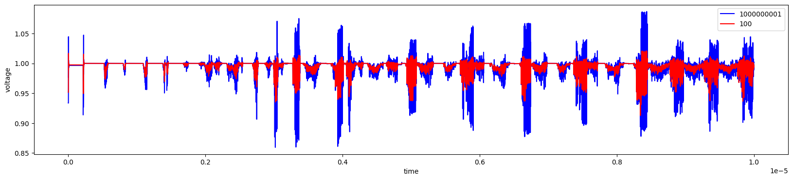

# 多核异构处理器供电网络优化设计模型及仿真

## 文件说明

- mypdn.cir--电路
- simulater.ipynb--spice仿真代码
- simulater.py--spice仿真代码[^1]
- load_test.py--负载测试代码
- figure\ *.*--仿真结果
- data\ *.*--数据

## 测试结果

供电端

负载端

供电端与负载端

[^1]: simulater.py和simulater.ipynb内容相同
